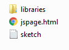

# Leson One Lab 1::Introduction to p5.js #

###Objectives###
 - Create a p5 project
 - Draw a rectangle on the Canvas
 - Find the p5js reference

##Part I: Add a project to you home drive##
 - On your Home Drive (H), create a folder for labs.  Inside the labs folder create a folder named "Lab816FirstProgram"
 - From the E17 share folder, copy the StartTemplate into your Lab816 folder
 - Rename the "StartTemplate" folder to "FirstProgram" 
 - Make sure the following are in your project folder
 
  

 - Open the project folder in Atom or drag index.html into Notepad++

###Part II: Add Code to you project###

 -  Add the following code to your project:
 -  in setup() add:
 
		background(200, 200, 200);
 
 -  in draw() add:
 
		fill(255, 5, 81);
		rect(100, 300, 50,50);

 -  Now drag your index.html file into your browser

####Part III: Go to the p5js reference
 - Through Google, find the p5 reference.  add other shapes to your project

----

